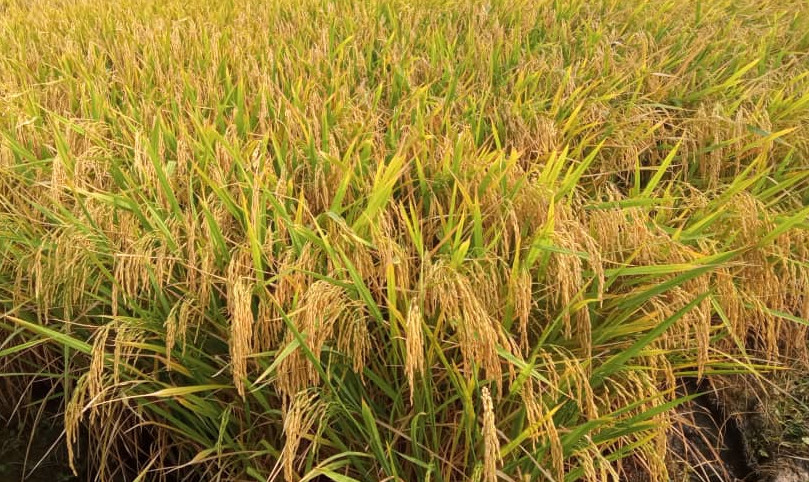

---
# RESILIA-FL
---

**Ing. Yuraima Mendoza** -  _Fitomejoradora_
 
**Ing. Orlando Pérez** -  _Gerente de Tecnología y Desarrollo_

***
## Características de la nueva variedad de arroz y su referencial de manejo agronómico

Estamos muy entusiamados de presentarles nuestra nueva variedad de arroz **RESILIA FL**. Con ella aspiramos poner en manos de los productores arroceros una herramienta tecnológica de alto desempeño en las variantes ambientales de las zonas arroceras del país. 
Después de cumplir con todos los requisitos establecidos por la ***Comisión Nacional de Semilla*** (Conasem), le fue asignado el ***código Nº CNS-CC-24-502-13*** en el ***Registro Nacional de Cultivares Comerciales***.

La variedad ***RESILIA FL***, proviene del cruce de FL11963/FL08283/FL09382/FL08336 y tiene por *Pedigree FL11963-2P-3-3P-1PY-M*.

Fue obtenida en el ***Fondo Latinoamericano de Arroz de Riego*** (FLAR) durante las generaciones segregantes F2 a F5; luego fue seleccionada y desarrollada por el programa de mejoramiento de la ***Asociación de Productores de Semilla Certificada de los Llanos Occidentales*** (APROSCELLO) con el apoyo de la ***Fundación Nacional del Arroz*** (FUNDARROZ).

***

### **Características agronómicas**

|                                  |                           |
|----------------------------------|---------------------------|
| Altura de la planta (cm)         | 92-102                    |
| Ciclo                            | Intermedio (110-115 días) |
| Hábito de crecimiento            | Semi-compacto             |
| Macollamiento                    | Buena capacidad           |
| Color de la hoja                 | Verde                     |
| Reacción al desgrane             | Moderadamente fuerte      |
| Reacción al volcamiento          | Resistente                |
| Tallo                            | Fuerte y flexible         |
| Fertilidad (%)                   | 91.4 - 93.9               |
| Nº de Granos por panícula        | 134 - 229                |
| Longitud de la panícula (cm)     | 26.4 - 28.9              |
| Retraso a cosecha                | Resistente                |
| Potencial de rendimiento (TN/ha) | Superior a 8.5            |

### **Reacción a plagas y enfermedades**

|                                                         |                 |
|---------------------------------------------------------|:---------------:|
|Piricularia hoja (*Pyricularia oryzae* )                 |Resistente       |
|Piricularia cuello (*Pyricularia oryzae* )               |Resistente       |
|Helminthosporiosis en hoja (*Helminthosporium oryzae*)   |Resistente       |
|Helminthosporiosis en cuello (*Helminthosporium oryzae*) |Resistente       |
|Escaldado (*Rhynchosporium oryzae*)                      |Resistente       |
|Manchado del grano                                       |Resistente       |
|Virus Hoja Blanca                                        |Tolerante        |
|Sogata (*Tagosodes orizicolus*)                          |Resistente       |

### **Características de la semilla**

|                           |            |
|---------------------------|:----------:|
|Longitud mm)               |10.0 - 11.0 |
|Ancho (mm)                 |2.0 - 3.0   |
|Espesor (mm)               |2.0         |
|Arista                     |Ausente     |
|Peso de 1000 semillas (gr) |26.0 - 28.1 |

***

## **REFERENCIAL DE MANEJO AGRONÓMICO**

A continuación les entregamos el *Referencial de Manejo Agronómico de la variedad **RESILIA FL***,  el cual consideramos una guía imprescindible para garantizar la optimización de su manejo en campo y alcanzar altos rendimientos. Aspiramos que tanto los agrotécnicos como los productores estudien con detenimiento las siguientes recomendaciones, que si bien tienden a ser muy generales, son la base orientativa que permitirá la toma de decisiones desde el momento de la siembra hasta la cosecha.

***
### **Densidad de siembra**

El cultivar fue evaluado bajo las diferentes modalidades de siembra que se utilizan en el país; a continuación hacemos las consideraciones pertinentes para cada sistema.

#### ***Sistema de barro batido y semilla pregerminada***

Bajo la modalidad de barro batido es factible utilizar densidades que estén entre los 80 y 130 kg/ha de semilla certificada. Sin embargo, debemos señalar enfáticamente que densidades mayores a 130 kg/ha no son recomendables ya que resultan en alta competencia intraespecífica y se reduce el macollamiento, al tiempo que no genera ningún efecto favorable al rendimiento.

Es importante que para este sistema el pregerminado se realice dándole a la semilla entre 24 a 36 horas de remojo y 24 horas de incubación; para una incubación correcta, coloque la semilla bajo sombra durante el tiempo que dure esta fase.

#### ***Sistemas de labranza en suelo seco y alternativos***

En sistemas de labranza reducida o conservacionista, se recomiendan densidades de entre los 60 y 90 kg/ha de semilla certificada, respetando que la profundidad de siembra esté en 2,5 cm de promedio y que ésta no sea mayor a 3 cm. Si la siembra es bajo el esquema de semilla tapada con rastra de tiro, recomendamos incrementar entre un 5 % a 7 % la densidad con el propósito de compensar las pérdidas que debido a las características del implemento queden muy profunda afectando su capacidad de emerger.

***
### **Control de malezas**

Fueron evaluadas las principales moléculas de herbicidas que se utilizan en el país y ninguna generó problemas de fitotoxicidad en sus dosis comerciales recomendadas. Estás moléculas fueron evaluadas en aplicaciones de ambiente controlado y en condiciones de campo, considerando testigos absolutos y mezclas tradicionales de herbicidas con preemergentes, postemergentes, de contacto y sistémicos.

A continuación algunos tips de importancia en el control de malezas con herbicidas:

-   Cuando se utilice semilla pregerminada, se recomienda que los controles de malezas se realicen en pre-emergencia temprana, esto es, entre los 5 y 10 dds (días después de la siembra).

-   En el caso de usar semilla seca (no pregerminada) es completamente viable realizar aplicaciones de control de malezas entre los primeros 3 días antes de la emergencia; sin embargo, es importante que la decisión sea avalada por un técnico que verifique el estado de avance de la etapa de germinación para no salirse del momento óptimo de aplicación.

***
### **Manejo de la fertilización**

Para una mejor nutrición de la planta y garantizar el uso eficiente de los fertilizantes, es fundamental considerar la interacción entre la fecha de aplicación (momento oportuno), el tipo de nutriente o elemento a aplicar y las dosis de los mismos en función del análisis de suelo correspondiente.
Se han definido algunas modalidades de fertilización como las más recomendadas en base a los resultados de investigaciones de campo; veámoslas a continuación:

**Con el fósforo y potasio incorporados en presiembra y tres reabonos**

|Momento                                 |Fuente            |Elementos   |Cantidad |
|----------------------------------------|------------------|------------|:-------:|
|**Presiembra incorporado**              |Fosfato diamónico |Fósforo (P) |Todo     |
|                                        |Cloruro de potasio|Potasio (K) |Todo     |
|**Reabono entre los 16 a 20 dds o dde** |Urea              |Nitrógeno (N)|25%     |
|**Reabono entre los 30 a 35 dds o dde** |Urea              |Nitrógeno (N)|40%     |
|**Reabon a los 45 dds o dde**           |Urea              |Nitrógeno (N)|35%     |

 

**Con el fósforo y potasio incorporados en presiembra y dos reabonos**

|Momento                                 |Fuente            |Elementos   |Cantidad |
|----------------------------------------|------------------|------------|:-------:|
|**Presiembra incorporado**              |Fosfato diamónico |Fósforo (P) |Todo     |
|                                        |Cloruro de potasio|Potasio (K) |Todo     |
|**Reabono entre los 16 a 20 dds o dde** |Urea              |Nitrógeno (N)|60%     |
|**Reabono entre los 40 a 45 dds o dde** |Urea              |Nitrógeno (N)|40%     |

 

**Modalidad tradicional**

|Momento                                 |Fuente            |Elementos   |Cantidad |
|----------------------------------------|------------------|------------|:-------:|
|**Básica entre los 8 y 12 dds o dde**   |Fórmula completa  |Nitrógeno (N) |20%    |
|                                        |                  |Fósforo (P) |Todo     |
|                                        |Cloruro de potasio|Potasio (K) |20%     |
|**Reabono entre los 25 a 30 dds o dde** |Urea              |Nitrógeno (N)|40%     |
|                                        |Cloruro de potasio |Potasio (K) |80%     |
|**Reabono a los 45 dds o dde**          |Urea              |Nitrógeno (N)|40%     |

> Las proporciones están sujetas al tipo de fuente de fertilizante disponible, la disponibilidad de cada elemento en el suelo, según resultado del análisis de suelo respectivo y los ajustes que el agrotécnico crea pertiente de realizar.

> dds => días después de la siembra

> dde => días después de la emergencia 

Un dato importante de manejo válido para ambas modalidades es que si por razones de logística la última enmienda de ***nitrógeno*** no se pudiera aplicar antes de la etapa de elongación, se recomienda esperar que esta etapa termine para poder realizarla, esto evitará que la planta crezca en altura por encima de su promedio lo que induciría a condiciones favorables para el acame o vuelco.

A continuación agregamos información complementaria sobre la fertilización:

-   **Nitrógeno (N):** No aplicar menos de 180 unidades/ha; no perder de vista la relación 1:1 con el potasio (K).

-   **Fósforo (P):** el cultivar mostró que para alcanzar un rendimiento superior a las 8 toneladas/ha, requirió la absorción de 43 kg/ha de P2O5, en base a esta información se recomienda un promedio de 22 unidades/ha de P2O5, sin embargo, esta cantidad debe ser ajustada en función de la disponibilidad del elemento en el suelo.

-   **Potasio (K):** este elemento fue muy determinante en la sanidad integral del cultivar, la producción de materia seca y su potencial de rendimiento. No fue posible obtener el patrón de extracción del suelo, sin embargo, en las correlaciones experimentales, las mejores respuestas en rendimiento de grano se alcanzaron con enmiendas de entre los 110 y 120 kg/ha de K2O; resaltamos que se pondere su aplicación en base al análisis de suelo y la dinámica del elemento en su relación con el nitrógeno (N) y el magnesio (Mg).

-   **Calcio, Magnesio y Azufre:** estos elementos también deben ser considerados para logar altos rendimientos; las referencias dadas a continuación también deben ser ajustadas a los resultados del análisis de suelo.

    -   **Calcio**: entre 11 y 16 kg/ha de Ca, preferiblemente con la fertilización básica.

    -   **Magnesio**: entre 8 y 12 kg/ha de Mg en la fertilización básica o en el primer reabono.

    -   **Azufre**: 16 y 22 kg/ha de S; preferiblemente en el primer reabono.

***
### **Manejo de enfermedades**

La variedad ***RESILIA FL*** ha sido evaluada en diferentes ambientes para conocer su comportamiento frente a las enfermedades fungosas más importantes del país. Su desempeño fue muy notable cuando el manejo de malezas y plagas, junto a la nutrición se realizaron considerando las recomendaciones antes señaladas, sin embargo, ante las variaciones climáticas que influyen sobre las condiciones predisponentes de los diferentes patógenos que atacan al cultivo de arroz, es recomendable que durante los meses del año donde se registran constantes precipitaciones y altas temperaturas, se realicen bajo asesoría técnica protecciones preventivas dirigidas a garantizar la sanidad integral de cultivo y la panícula, de esta manera se evitaría posibles brotes del complejo de patógenos responsable del manchado de granos.

***

### **Manejo del riego**

La variedad ***RESILIA FL*** no demanda el establecimiento de láminas de agua por largos periodos de tiempo. Entre sus características sobresalientes está el de requerir menor volumen de agua de riego que otros cultivares; el mayor número de tallos efectivos se logró manejando el cultivar con riego intermitente durante los primeros 35 dds. Sin embargo, durante la fase reproductiva recomendamos que se establezca la lámina para garantizar el normal desarrolla de las etapas de emergencia de panículas, floración, grano lechoso y grano pastoso. Estas etapas son críticas para definir un buen llenado y calidad de grano.

El momento de drenaje del campo debe realizarse preferentemente bajo evaluación técnica ya que deben considerarse algunos aspectos fisiológicos del llenado de granos tales como: avance de la maduración,  ángulo de inclinación de la panícula, superior a 120º, evaluar las condiciones ambientales del ciclo de siembra (periodo seco -- periodo lluvioso).

***

### **Cosecha**

***RESILIA FL*** puede tolerar retrasos a la cosecha, siendo una característica importante por los diferentes factores que pueden interferir al momento de ejecutar la recolección del grano (lluvia, logística de cosecha, accidentes de maquinaria entre otros).

Recomendamos que se revise periódicamente la calibración de la cosechadora combinada para reducir las pérdidas que con frecuencia suceden durante esta importante tarea.

Humedad del grano ideal para la recolección: entre 22% y 20%.

***
Si tiene preguntas o dudas sobre la información de manejo de la ***RESILIA FL***, no dude en consultarnos a los correos:

-   [Aproscello: aproscello@gmail.com](mailto:aproscello@gmail.com)

-   [Ing. Orlando Pérez: orlandoinvestiga@gmail.com](mailto:orlandoinvestiga@gmail.com)

  y con mucho gusto ampliaremos la información.

